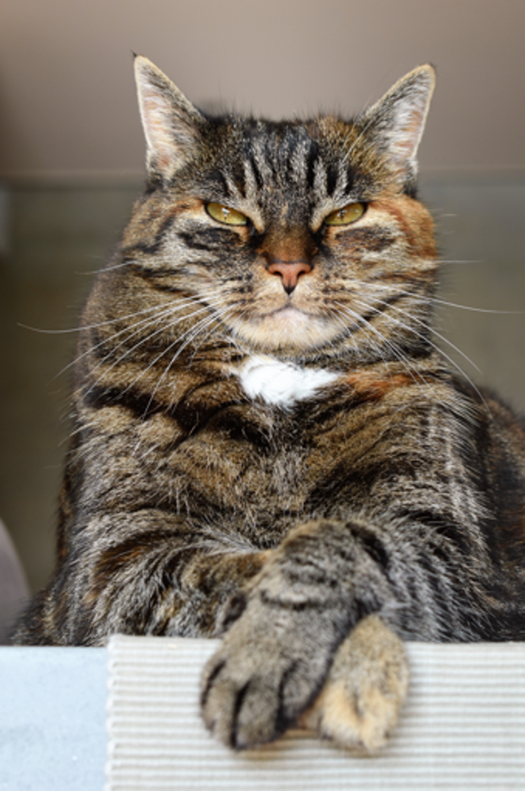

# Deep-Pixel-Magic

Welcome to the source code of *Deep-Pixel-Magic*! A solution for **AI Image Super Resolution**.

## Overview

This project implements two deep neural networks for image super-resolution. Both networks are based on the corresponding papers with slight modifications.

### EDSR (Enhanced Deep Super-Resolution)

The EDSR network is trained using only *Mean-Squared-Error* (MSE) loss. This results in pixel accurate representations of the original image. However, because of the attempt to be as pixel accurate as possible, the resulting image appears blurry.

Bicubic (x4) | EDSR (x4) | Original
:---:|:---:|:---:
 |  | 

### SRGAN (Super-Resolution Generative Adversarial Network)

The SRGAN network is trained in two steps. First, the weights of the network are pre-initialized by training the generator network using only the *Mean-Squared-Error* (MSE) loss function. Then, the network is trained using a combination of MSE loss, VGG-based feature loss (perceptual loss), and the generator loss resulting from the discriminator trained in parallel.

This process causes the network to prioritize higher-level features over pure pixel accuracy, resulting in a much sharper representation of the low-resolution image. However, prioritizing high-level features also causes the network to be less pixel accurate. As a result, strange structures may appear when upscaling an image, especially when upscaling high frequency details (such as hair or vegetation).

Bicubic (x4) | SRGAN (x4) | Original
:---:|:---:|:---:
 |  | 

### Comparison

Here's a comparison between both the EDSR and the SRGAN model:

EDSR (x4) | SRGAN (x4) | Original
:---:|:---:|:---:
 |  | 

## Usage

To upscale images using either model, use the appropriate prediction routine. For the EDSR model, run:

```sh
python edsr_predict.py
```

For the SRGAN model, run:

```sh
python srgan_predict.py
```

If you want to use the pre-trained models, be sure to adjust the model path loaded in the corresponding prediction routine. The pre-trained models are located in: `./pre_trained/`.

## Training

To train the models, download the DIV2K dataset. For training, download the training subsets:

```sh
python div2k.py --scale x4 --subset training --sampling bicubic --resolution low
python div2k.py --scale x4 --subset training --sampling bicubic --resolution high
```

For validation, download the validation subsets:

```sh
python div2k.py --scale x4 --subset validation --sampling bicubic --resolution low
python div2k.py --scale x4 --subset validation --sampling bicubic --resolution high
```

To train the EDSR model, run:

```sh
python edsr_train.py
```

To train the entire SRGAN model, including pre-initialization and GAN training, run:

```sh
python srgan_complete.py
```

To train the SRGAN model in two separate steps (as described above), use the following:

```sh
python srgan_pre_train.py
python srgan_train.py
```
